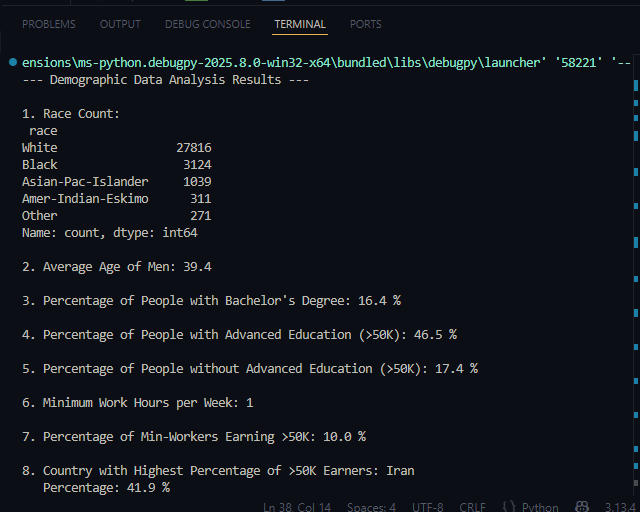

# demographic-data-analyzer
#
#This project analyzes demographic data from the 1994 Census database

import pandas as pd
import numpy as np # Ensure numpy is imported

def calculate_demographic_data(df=None):
    """
    Analyzes demographic data from the 1994 Census database using Pandas.

    Args:
        df (pd.DataFrame, optional): The DataFrame containing demographic data.
                                      If None, the function will attempt to load 'adult.data'.

    Returns:
        dict: A dictionary containing the answers to the demographic questions.
    """
    if df is None:
        column_names = [
            'age', 'workclass', 'fnlwgt', 'education', 'education-num',
            'marital-status', 'occupation', 'relationship', 'race', 'sex',
            'capital-gain', 'capital-loss', 'hours-per-week', 'native-country', 'salary'
        ]
        
        # --- Robust settings for reading 'adult.data' ---
        # This configuration is designed to handle common formatting issues in this specific dataset.
        df = pd.read_csv(
            'adult.data',
            names=column_names,
            sep=r',\s*',           # Uses a regex separator: comma followed by zero or more spaces
            engine='python',        # Python engine is required for regex separators and handles complex parsing better
            na_values=['?', ' ?', ' ? '], # Treats '?' and ' ? ' (with spaces) as NaN (missing values)
            skipinitialspace=True,  # Skips spaces immediately following the delimiter
            on_bad_lines='skip',    # **CRUCIAL:** Skips lines that cause parsing errors instead of stopping execution
            encoding='utf-8',       # Explicitly specifies UTF-8 encoding for robust text handling
        )
        # --- End of robust settings ---

        # Data Cleaning: Strip any leading/trailing whitespace from all string (object) columns
        # This is essential as some values in adult.data might have extra spaces (e.g., ' Male' vs 'Male')
        for col in df.select_dtypes(include='object').columns:
            df[col] = df[col].str.strip()

    # 1. How many people of each race are represented in this dataset?
    # This should be a Pandas series with race names as the index labels.
    race_count = df['race'].value_counts()

    # 2. What is the average age of men?
    # Filter for 'Male' entries and calculate the mean of their ages, rounded to one decimal place.
    average_age_men = round(df[df['sex'] == 'Male']['age'].mean(), 1)

    # 3. What is the percentage of people who have a Bachelor's degree?
    # Count people with Bachelor's degree and calculate their percentage relative to the total population.
    bachelors_count = df[df['education'] == 'Bachelors'].shape[0]
    total_people = df.shape[0]
    percentage_bachelors = round((bachelors_count / total_people) * 100, 1)

    # 4. What percentage of people with advanced education (Bachelors, Masters, or Doctorate) make more than 50K?
    # Define the degrees considered as advanced education.
    advanced_education_degrees = ['Bachelors', 'Masters', 'Doctorate']
    
    # Filter for people with advanced education.
    advanced_education = df[df['education'].isin(advanced_education_degrees)]
    
    # From the advanced education group, filter for those earning more than 50K.
    advanced_education_rich = advanced_education[advanced_education['salary'] == '>50K']
    
    # Calculate percentage, handling potential division by zero.
    if advanced_education.shape[0] > 0:
        percentage_advanced_education_rich = round(
            (advanced_education_rich.shape[0] / advanced_education.shape[0]) * 100, 1
        )
    else:
        percentage_advanced_education_rich = 0.0 

    # 5. What percentage of people without advanced education make more than 50K?
    # Define people without advanced education (by checking they are NOT in the advanced_education_degrees list).
    non_advanced_education = df[~df['education'].isin(advanced_education_degrees)] 
    
    # From the non-advanced education group, filter for those earning more than 50K.
    non_advanced_education_rich = non_advanced_education[non_advanced_education['salary'] == '>50K']
    
    # Calculate percentage, handling potential division by zero.
    if non_advanced_education.shape[0] > 0:
        percentage_non_advanced_education_rich = round(
            (non_advanced_education_rich.shape[0] / non_advanced_education.shape[0]) * 100, 1
        )
    else:
        percentage_non_advanced_education_rich = 0.0 

    # 6. What is the minimum number of hours a person works per week?
    # Find the minimum value in the 'hours-per-week' column.
    min_work_hours = df['hours-per-week'].min()

    # 7. What percentage of the people who work the minimum number of hours per week have a salary of more than 50K?
    # Filter for people working the minimum hours.
    num_min_workers = df[df['hours-per-week'] == min_work_hours]
    
    # From this group, calculate the percentage who earn more than 50K, handling division by zero.
    if num_min_workers.shape[0] > 0:
        rich_percentage = round(
            (num_min_workers[num_min_workers['salary'] == '>50K'].shape[0] / num_min_workers.shape[0]) * 100, 1
        )
    else:
        rich_percentage = 0.0

    # 8. What country has the highest percentage of people that earn >50K and what is that percentage?
    # Group by 'native-country' and count salary categories, then unstack to get columns for '>50K' and '<=50K'.
    country_salary_counts = df.groupby('native-country')['salary'].value_counts().unstack().fillna(0)
    
    # Ensure '>50K' and '<=50K' columns exist (in case a country has no data in one category).
    if '>50K' not in country_salary_counts.columns:
        country_salary_counts['>50K'] = 0
    if '<=50K' not in country_salary_counts.columns:
        country_salary_counts['<=50K'] = 0 

    # Calculate total people per country.
    country_salary_counts['Total'] = country_salary_counts['>50K'] + country_salary_counts['<=50K']
    
    # Calculate percentage of rich people for each country, robustly handling division by zero or NaN results.
    country_salary_counts['Percentage_Rich'] = (
        (country_salary_counts['>50K'] / country_salary_counts['Total']) * 100
    ).replace([np.inf, -np.inf], np.nan).fillna(0) # Replaces inf/NaN from 0/0 or X/0 with 0.0
    
    # Find the country with the highest percentage and its corresponding percentage.
    highest_earning_country = country_salary_counts['Percentage_Rich'].idxmax()
    highest_earning_country_percentage = round(country_salary_counts['Percentage_Rich'].max(), 1)

    # 9. Identify the most popular occupation for those who earn >50K in India.
    # Filter the DataFrame for people from 'India' who earn '>50K'.
    india_rich_occupation_df = df[(df['native-country'] == 'India') & (df['salary'] == '>50K')]
    
    # Find the most frequent occupation in this filtered group.
    if not india_rich_occupation_df.empty: # Check if the filtered DataFrame is not empty
        top_occupation_india = india_rich_occupation_df['occupation'].value_counts().idxmax()
    else:
        top_occupation_india = None # Return None if no matching data (e.g., no rich people from India)

    # Return results as required by FreeCodeCamp's tests.
    return {
        'race_count': race_count,
        'average_age_men': average_age_men,
        'percentage_bachelors': percentage_bachelors,
        'percentage_advanced_education_rich': percentage_advanced_education_rich,
        'percentage_non_advanced_education_rich': percentage_non_advanced_education_rich,
        'min_work_hours': min_work_hours,
        'rich_percentage': rich_percentage,
        'highest_earning_country': highest_earning_country,
        'highest_earning_country_percentage': highest_earning_country_percentage,
        'top_occupation_india': top_occupation_india
    }

# --- Example Usage (for local testing purposes) ---
# This part of the code will only run if the script is executed directly (not imported as a module).
# Make sure the 'adult.data' file is in the same directory as this script.
if __name__ == "__main__":
    try:
        # Load the data for local testing using the same robust logic as inside the function
        column_names_for_testing = [
            'age', 'workclass', 'fnlwgt', 'education', 'education-num',
            'marital-status', 'occupation', 'relationship', 'race', 'sex',
            'capital-gain', 'capital-loss', 'hours-per-week', 'native-country', 'salary'
        ]
        df_for_testing = pd.read_csv(
            'adult.data',
            names=column_names_for_testing,
            sep=r',\s*',
            engine='python',
            na_values=['?', ' ?', ' ? '],
            skipinitialspace=True,
            on_bad_lines='skip',
            encoding='utf-8',
        )
        
        # Apply whitespace stripping after loading for consistency
        for col in df_for_testing.select_dtypes(include='object').columns:
            df_for_testing[col] = df_for_testing[col].str.strip()

        results = calculate_demographic_data(df_for_testing)

        print("--- Demographic Data Analysis Results ---")
        print("\n1. Race Count:\n", results['race_count'])
        print("\n2. Average Age of Men:", results['average_age_men'])
        print("\n3. Percentage of People with Bachelor's Degree:", results['percentage_bachelors'], "%")
        print("\n4. Percentage of People with Advanced Education (>50K):", results['percentage_advanced_education_rich'], "%")
        print("\n5. Percentage of People without Advanced Education (>50K):", results['percentage_non_advanced_education_rich'], "%")
        print("\n6. Minimum Work Hours per Week:", results['min_work_hours'])
        print("\n7. Percentage of Min-Workers Earning >50K:", results['rich_percentage'], "%")
        print("\n8. Country with Highest Percentage of >50K Earners:", results['highest_earning_country'])
        print("   Percentage:", results['highest_earning_country_percentage'], "%")
        print("\n9. Most Popular Occupation for Rich Indians:", results['top_occupation_india'])

    except FileNotFoundError:
        print("Error: 'adult.data' not found. Please make sure the dataset file is in the same directory as the script.")
        print("You can download it from: https://raw.githubusercontent.com/freeCodeCamp/boilerplate-demographic-data-analyzer/master/adult.data")
    except Exception as e:
        print(f"An unexpected error occurred: {e}. This might be due to a corrupted 'adult.data' file or a very unusual line format.")
        print("Please double-check your 'adult.data' file content and ensure it's the correct, full version.")
